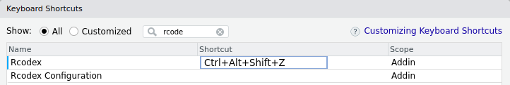
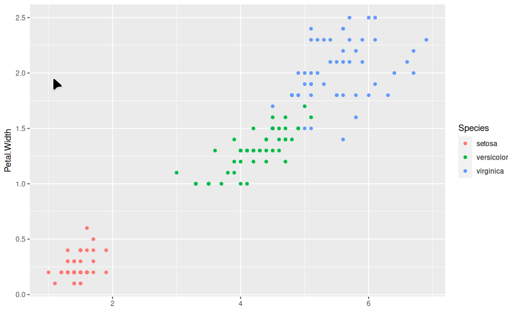

RCodex
================
2023-03-25

This package will use Models from OpenAI to create code for you.

You just write the text and the code will appear.

## Installation

Install from GitHub using

``` r
# install.packages("devtools")
devtools::install_github("PatronMaster/rcodex")
```

You need create a [API KEY in
openAI](https://platform.openai.com/account/api-keys)

Now, click in Addins and Rcodex Configuration


Now insert the API Key, you can change the model and max tokens.


Click in done.

**Optional:**

Add shortcuts to be fast in Tools, Addins, Browse Addins




## Usage

Write your text in any language, select and press Rcodex or defined
shortcut.




## Update

Version 0.2

New Models added:
“gpt-4”,“gpt-4-32k”,“gpt-3.5-turbo-0301”,“gpt-3.5-turbo”

Option to choose another programming language than R for the output.

## FUNNY (I create this package because was feedback from CHAT GTP)

I asked to CHAT GPT how can use codex in Rstudio, the answer was the
below, so to fix this error I create the package :D

To use Codex to translate natural language into R code, you will need to
install Codex and R on your computer and open RStudio. Then you can
follow these steps:

1.  Open Codex in RStudio: click on “Addins” at the top of the RStudio
    screen and select “Translate natural language to code with Codex”
    from the list of Addins. This will open the Codex under the “Addins”
    tab on the right side of RStudio.

2.  Type or paste the natural language text you want to translate into R
    code in the Codex.

3.  Click the “Translate” button to translate the text into R code. The
    resulting R code will be displayed in the Codex window.

4.  Copy the R code to the RStudio editor window and press “Ctrl +
    Enter” to run it.

I hope this helps! If you have further questions, please don’t hesitate
to ask.
